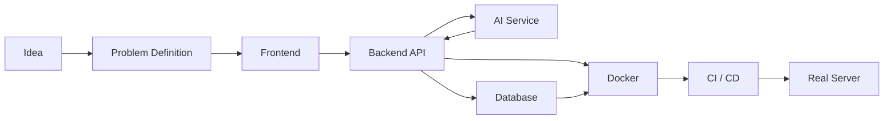

<!-- Profile README for chl4890620123-collab -->

<div align="center">


<a href="https://git.io/typing-svg">
  
</a>

<br/>


</div>

## 👋 About Me

안녕하세요, **명헌**입니다.

저는 AI 기능을 데모에서 끝내지 않고 **실제로 사용할 수 있는 서비스 구조까지 연결하는 개발**을 좋아합니다.

```text
Idea → Frontend → Backend API → AI Service → Database → Docker → Deployment
```

- 🤖 AI 기능을 실제 서비스 흐름에 연결합니다.
- ⚙️ Spring Boot / FastAPI 기반 백엔드 시스템을 구축합니다.
- 🗄️ MariaDB를 활용해 데이터와 서비스 흐름을 설계합니다.
- 🐳 Docker / GitHub Actions 기반 배포 자동화를 구성합니다.
- 🔗 특정 API에 과도하게 종속되지 않는 낮은 결합도의 구조를 지향합니다.
- 📊 단순한 LLM 응답보다 측정값·이력·근거가 남는 시스템을 선호합니다.

---

## 🚀 Featured Projects

<div align="center">

<a href="https://github.com/chl4890620123-collab/Aitm"></a>


<br/>
<a href="https://github.com/chl4890620123-collab/Restok-Rangchain"></a>


<br/>

<a href="https://github.com/chl4890620123-collab/maple"></a>


<br/>
<a href="https://github.com/chl4890620123-collab/Server"></a>


<br/>

</div>

### 🥋 AITM — AI Taekwondo Master

`React` `Spring Boot` `FastAPI` `MediaPipe` `OpenCV` `MariaDB` `Docker`

영상에서 Pose 관절 좌표를 측정하고 무릎 각도, 회전, 타이밍, 착지 등을 분석해 **측정 근거가 남는 AI 태권도 코칭**을 구현하는 프로젝트입니다.

### 📦 Restok — Item Lifecycle Platform

`React` `Spring Boot` `FastAPI` `Gemini` `MariaDB` `Docker`

물건 등록부터 사용·판매·기부·재활용·폐기까지 이어지는 **물품 생애주기 관리 플랫폼**입니다. AI는 영수증 분석과 사용자 판단 보조에 활용합니다.

### 🍁 Maple Craft Analytics

`Python` `FastAPI` `MariaDB` `Docker` `GitHub Actions`

재료 가격, 제작비, 판매가, 수수료와 실현수익을 기록하고 분석하는 **데이터 기반 제작·판매 분석 프로젝트**입니다.

### 🖥️ Server

`Docker Compose` `GitHub Actions` `Reverse Proxy` `Deployment`

여러 프로젝트의 운영 배포 구성을 중앙에서 관리하는 저장소입니다. 앱 저장소와 운영 환경을 분리해 배포 구조를 단순화하는 것을 목표로 합니다.

---

## 🏆 Organization

<div align="center">

<a href="https://github.com/aichallengers-hub/hub"></a>


<br/>

</div>

### 🤝 AI Challengers Hub

`Organization` `AI` `Collaboration`

[**aichallengers-hub**](https://github.com/aichallengers-hub) 조직의 중심 저장소입니다. AI 프로젝트와 챌린지를 함께 진행하고 결과물을 한곳에 모아 관리하는 허브 역할을 합니다.

---

## 🛠 Tech Stack

<div align="center">

### Backend


### Frontend


### Database & Infra


### AI / Computer Vision


</div>

---

## 📊 GitHub Activity

<div align="center">

<picture>
  <source media="(prefers-color-scheme: dark)" srcset="https://raw.githubusercontent.com/chl4890620123-collab/chl4890620123-collab/main/profile-summary-card-output/github_dark/0-profile-details.svg" />
  
</picture>

<picture>
  <source media="(prefers-color-scheme: dark)" srcset="https://raw.githubusercontent.com/chl4890620123-collab/chl4890620123-collab/main/profile-summary-card-output/github_dark/3-stats.svg" />
  
</picture>
<picture>
  <source media="(prefers-color-scheme: dark)" srcset="https://raw.githubusercontent.com/chl4890620123-collab/chl4890620123-collab/main/profile-summary-card-output/github_dark/2-most-commit-language.svg" />
  
</picture>

<picture>
  <source media="(prefers-color-scheme: dark)" srcset="https://raw.githubusercontent.com/chl4890620123-collab/chl4890620123-collab/main/profile-summary-card-output/github_dark/1-repos-per-language.svg" />
  
</picture>
<picture>
  <source media="(prefers-color-scheme: dark)" srcset="https://raw.githubusercontent.com/chl4890620123-collab/chl4890620123-collab/main/profile-summary-card-output/github_dark/4-productive-time.svg" />
  
</picture>

</div>

---

## 🐍 Contribution Snake

<div align="center">

<picture>
  <source media="(prefers-color-scheme: dark)" srcset="https://raw.githubusercontent.com/chl4890620123-collab/chl4890620123-collab/gh-pages/github-contribution-grid-snake-dark.svg" />
  <source media="(prefers-color-scheme: light)" srcset="https://raw.githubusercontent.com/chl4890620123-collab/chl4890620123-collab/gh-pages/github-contribution-grid-snake.svg" />
  
</picture>

</div>

---

## 🧩 How I Build


```mermaid
graph LR
    A[Idea] --> B[Problem Definition]
    B --> C[Frontend]
    C --> D[Backend API]
    D --> E[AI Service]
    D --> F[Database]
    E --> D
    D --> G[Docker]
    F --> G
    G --> H[CI / CD]
    H --> I[Real Server]
```

<div align="center">

### 🚀 Build · Connect · Deploy

**AI를 보여주기 위한 프로젝트보다 실제로 사용할 수 있는 서비스를 만드는 것을 목표로 합니다.**


</div>
